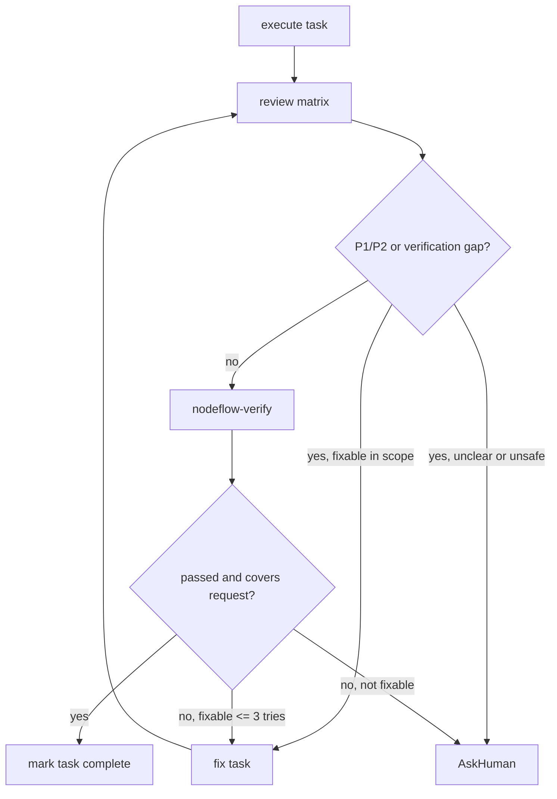

# Task Review Loop

Use this after each task that changes files or project behavior. The goal is to
catch mismatch early, before downstream tasks build on a bad state.

## Review Matrix

Run the smallest matrix that matches risk and scope:

| Review profile | Required when | Checks |
| --- | --- | --- |
| spec-review-agent | Medium / High risk, behavior changes, planned tasks | requirement_anchor, accepted scope, non-goals, acceptance criteria |
| code-quality-review-agent | code/config changes | bugs, regressions, ownership, duplication, user-change preservation |
| verification-review-agent | every task with verification command or observable behavior | command relevance, output, exit code, failure count, coverage |
| capability-review-agent | `capability_skills` declared | specialist skill rules, e.g. frontend design, shadcn, browser verification |
| risk-review-agent | release, security, privacy, migration, data, account, or production impact | irreversible impact, credentials, external systems, rollback, HITL need |

If subagent tools are available and the execution mode allows it, dispatch these
as separate reviewers. Otherwise run them as separate review profiles in the
controller session. Do not skip a required profile because subagents are
unavailable.

## Loop



## Fixability

Fixable in scope:

- syntax, type, import, lint, formatting, local assertion failures
- missed acceptance criterion with clear expected behavior
- review finding caused by this task and confined to declared files
- missing capability-specific observable check that can be run locally

Not fixable without human input:

- unclear product behavior
- new architecture decision
- external account, payment, release, privacy, production data, or credentials
- changes outside approved scope
- repeated failure after 3 attempts

## State Updates

When state exists, update the task with:

```json
{
  "review_matrix": ["spec-review-agent", "code-quality-review-agent"],
  "review_findings": [],
  "retry_count": 0,
  "status": "completed|needs_review|failed"
}
```

Downstream DAG tasks stay blocked until the current task has passed required
reviews and verification.
