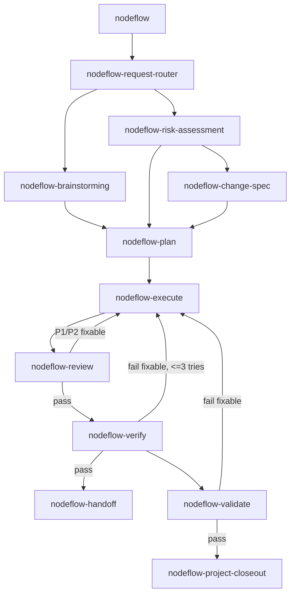

# Nodeflow Node Registry

Use this registry when `nodeflow` needs node metadata or a default chain. Keep detailed procedures inside each node's own `SKILL.md`.

## Status Rules

```plain text
core        default building blocks for active nodeflows
specialized domain-specific node used only when matched
legacy      older composite nodeflow; explicit invocation only
archived    not used for active routing
```

Capability skills are not node statuses. If a skill only provides specialist
knowledge or execution technique, move it to `references/capability-skills.md`
and keep it out of the Nodeflow node tables.

## Checkpoint Output Rule

When a node's default checkpoint is `Y`, or a project nodeflow stage says `checkpoint: Y`, pause after that node or stage and provide a focused `Human Check`.

The detailed checkpoint format and `AskHuman` adapter rules live in `askhuman-protocol.md`. Do not duplicate them here.

## Checkpoint vs HITL

- `checkpoint`: a review gate after a node or stage has produced an output.
- `HITL`: a task-level requirement before or during execution when human judgment, credentials, subjective acceptance, or business/legal/product decision is needed.
- Do not convert every checkpoint into a HITL task.
- Do not postpone a required HITL decision until checkpoint output if execution depends on that decision.

## Intake and Brainstorming / Design Gate

Before routing, decide whether the request is extremely simple Ultra-low risk, non-code capability direct, clear Low-risk, or needs `nodeflow-brainstorming`.

- **Ultra-low risk**: spelling correction, single-line configuration, small documentation update. Auto-trigger execution directly without confirmation.
- **Non-code Capability Direct**: pure research, analysis, or non-code task. Direct capability activation, bypassing core flow.
- **Clear Low-risk work**: concise requirement confirmation is enough.
- **Creative work, new features, architecture changes, behavior changes, oversized requests, and unclear requirements**: run `nodeflow-brainstorming` first.
- `nodeflow-brainstorming` is the hard design/spec gate. It writes the confirmed spec under `docs/specs/`, runs spec self-review, waits for user review, then hands off to `nodeflow-plan`.

Do not jump from an under-specified idea directly to a confirmation template, nodeflow proposal, or implementation.

## Document Budget

```plain text
none              no task-level docs by default
plan-only         plan file only when it adds execution value
spec+plan         confirmed spec/scope before plan
durable-evidence  keep review/report evidence for high-risk handoff
```

Defaults:

- Ultra-low / Non-code Direct: `none`.
- Low: `none`.
- Medium: `plan-only` only when ordering, multi-file scope, or multi-step verification matters.
- High / creative / architecture / behavior-changing: `spec+plan`.
- Review and verification reports: no file by default; use `durable-evidence` only for release, migration, failed checks, security/privacy, production risk, or cross-agent handoff.

## Execution Mode

```plain text
simple-sequential  Low risk, direct execution, verify, handoff
planned-sequential plan exists and tasks are ordered in one workspace
subagent-driven    independent tasks can run in parallel without file conflicts
worktree-subagent  parallel or complex tasks run in isolated worktrees
```

Use the simplest mode that preserves safety.

## Worktree Policy

- Complex implementation or parallel tasks: recommend isolated worktree.
- Required when multiple agents/subagents will modify overlapping repo history or when isolation materially reduces merge risk.
- Exception allowed for docs-only work, small fixes, or environment-sensitive projects; state the reason as `exception:<reason>`.

## Capability Skills

Capability skills are ordinary specialist skills used inside plan, execute,
review, or verify. They are not Nodeflow nodes and must not be added to default
chains unless they become a reusable workflow stage with clear input, output,
gate, and downstream nodes.

- Use `references/capability-skills.md` for the current mapping.
- Plans may declare `capability_skills`.
- Execution loads declared capability skills before editing files.
- Review checks the result against declared specialist rules.
- Verification includes capability-specific observable evidence when needed.
- Do not change risk level, document budget, or execution mode merely because a capability skill exists.

Downgraded capability skills:

- `reference-analysis`
- `prompt-optimize`
- `notion-page`
- `app-market-promotion`
- `write-agents-md` (auto-triggered by `nodeflow-architecture`)
- `ui-polish` (formerly `nodeflow-ui-polish`)
- `doc-update` (formerly `nodeflow-doc-update`)
- `feature-polish` (formerly `nodeflow-feature-polish`)

## Task Document Policy

- Main docs are long-lived project facts and stay in stable paths such as `docs/PRD.md`, `docs/ARCH.md`, `docs/CONTEXT.md`, `docs/DECISIONS.md`, and `docs/CHANGELOG.md`.
- Task-level docs are grouped by type and include the task name in the filename.
- Low-risk 1-to-N tasks must not create task-level docs by default.
- Medium-risk 1-to-N tasks create `docs/plans/YYYY-MM-DD-request-name-plan.md` only when planning adds execution value.
- High-risk, creative, architecture, or behavior-changing 1-to-N tasks create or confirm `docs/specs/YYYY-MM-DD-request-name.md` before planning.
- Reviews and reports are durable evidence only when traceability, failed checks, release risk, or handoff requires them; use `docs/reviews/` and `docs/reports/` for those cases.
- Do not delete or archive task-level docs silently. Handoff or closeout should recommend cleanup and wait for explicit approval.

## Flow Graph and Loops

Nodeflow is a directed graph with controlled loops, not a one-way linear chain.



Loop rules:

- Review and verify may route back to `nodeflow-execute` for the same task.
- A task may retry at most 3 times before stopping for `AskHuman`.
- `nodeflow-validate` may route back to execute only when the failure is local and fixable.
- A failed task blocks downstream DAG tasks until fixed and verified.
- Checkpoints and HITL decisions pause loops when human judgment is required.

## Core Nodes

| Node ID | Role | Input | Output | Gate | Downstream | Risk |
|---|---|---|---|---|---|---|
| `nodeflow` | unified entry / router | user request, project state, available nodes | confirmed requirement, mode, risk, document budget, execution mode, worktree policy, recommended chain, optional candidate nodes, checkpoint | requirement confirmation before nodeflow generation; nodeflow approval before execution | any nodeflow node | Low / Medium / High |
| `nodeflow-request-router` | 1-to-N request classifier | user request, AGENTS.md, docs/context | request type, initial route, `nodeflow-brainstorming` gate, initial document/execution mode | unclear request type stops | `nodeflow-risk-assessment`, selected nodes | Low / Medium / High |
| `nodeflow-brainstorming` | brainstorming / design gate | unclear or creative request, project context, constraints | confirmed requirement, approach, Decision Log, reviewed spec | design and written spec approval before plan or implementation | `nodeflow-plan` | Medium / High |
| `nodeflow-risk-assessment` | risk and scope evaluator | request type, context, git diff, relevant files | risk, impact, spec/plan/checkpoint need, document budget, execution mode, worktree policy | unclear impact stops | `nodeflow-change-spec`, `nodeflow-plan`, `nodeflow-execute` | Low / Medium / High |
| `nodeflow-brief` | 0-to-1 starter & intake | rough project idea, project path, tech constraints | `docs/BRIEF.md` and workspace initialization | missing core goal, tech stack, or unsafe path stops | `nodeflow-prd`, `nodeflow-request-router`, `nodeflow-plan` | Medium / High |
| `nodeflow-prd` | product definition | brief, product context | `docs/PRD.md` (containing Interaction Flow & App Surface) | unresolved product decisions stop | `nodeflow-architecture` | Medium / High |
| `nodeflow-architecture` | architecture decision | PRD, repo context, constraints | `docs/ARCH.md`, `AGENTS.md` | unresolved technical decision stops | `nodeflow-plan` | High |
| `nodeflow-change-spec` | existing-project spec | request, project context | scoped spec | ambiguous behavior stops | `nodeflow-plan` | Medium / High |
| `nodeflow-plan` | unified task planning | spec/request, context | `docs/TASKS.md` (for 0-to-1) or plan file (for 1-to-N) | unsafe or unclear plan stops | `nodeflow-execute` | Medium / High |
| `nodeflow-execute` | implementation | approved request/plan/task, files, repo context | code/docs changes and verification evidence | missing required context stops | `nodeflow-review`, `nodeflow-verify` | Low / Medium / High |
| `nodeflow-review` | review local changes | diff, original request, tests | findings, gaps, summary | unresolved high-risk finding stops | `nodeflow-execute`, `nodeflow-verify` | Low / Medium / High |
| `nodeflow-verify` | final verification | verification command, current state | command result and coverage | no fresh evidence stops completion claim | `nodeflow-handoff`, `nodeflow-validate` | Low / Medium / High |
| `nodeflow-validate` | broader validation | project checks, release/build context | validation report | failed required check stops | `nodeflow-handoff` | Medium / High |
| `nodeflow-handoff` | closeout & handoff | completed work, evidence, gaps | user-facing handoff and closeout/archive results | missing evidence or blockers stops | none | Low / Medium / High |

## Specialized Nodes

| Node ID | Role | Input | Output | Gate | Downstream | Risk |
|---|---|---|---|---|---|---|
| `nodeflow-bug-diagnose` | bug root-cause diagnosis | symptoms, reproduction, logs, relevant code | root cause, fix direction | unproven root cause stops blind fix | `nodeflow-risk-assessment`, `nodeflow-plan` | Medium / High |
| `nodeflow-refactor` | behavior-preserving refactor | target code, constraints | scoped refactor | behavior change risk stops | `nodeflow-execute`, `nodeflow-review` | Medium |
| `nodeflow-release-prep` | release preparation | release target, checks, store/build context | release checklist/results | missing release context stops | `nodeflow-validate`, `nodeflow-handoff` | High |
| `nodeflow-learn` | learn mode handler | decision point context (source node, decision, alternatives) | knowledge entry in `docs/knowledge/` | learn_mode false or user skip stops | returns to caller | N/A |

## Deleted Legacy Nodes

The following legacy nodes have been deleted. Their functionality is fully covered by core node chains:

- `nodeflow-feature-dev` → `nodeflow-request-router -> nodeflow-risk-assessment -> nodeflow-change-spec -> nodeflow-plan -> nodeflow-execute -> nodeflow-review -> nodeflow-verify -> nodeflow-handoff`
- `nodeflow-bug-fix` → `nodeflow-request-router -> nodeflow-bug-diagnose -> nodeflow-risk-assessment -> nodeflow-plan -> nodeflow-execute -> nodeflow-review -> nodeflow-verify -> nodeflow-handoff`
- `nodeflow-code-review` → `nodeflow-review` (Feature Quality Checklist absorbed)
- `nodeflow-request-template` → `nodeflow-request-router` or `nodeflow-change-spec`
- `nodeflow-start` → `nodeflow-brief`
- `nodeflow-init` → `nodeflow-brief`
- `nodeflow-interaction-flow` → `nodeflow-prd`
- `nodeflow-task-breakdown` → `nodeflow-plan`
- `nodeflow-project-closeout` → `nodeflow-handoff`

## Default Chains

### New Project

First choose an init profile:

```plain text
docs-maintenance
existing-codebase
new-flutter-app
new-generic-code
product-planning-only
```

Do not assume the code root is `src/`. Existing codebases keep their current structure. Flutter projects use `lib/` unless the repo proves otherwise. If the stack or code root is unclear, stop before code directory creation.

Default product chain:

```plain text
nodeflow-brief
-> nodeflow-prd
-> nodeflow-architecture
-> nodeflow-plan
-> nodeflow-execute
-> nodeflow-validate
-> nodeflow-handoff
```

Docs/process maintenance chain:

```plain text
nodeflow-brief
-> nodeflow-plan
-> nodeflow-execute
-> nodeflow-verify
-> nodeflow-handoff
```

Existing-codebase chain:

```plain text
nodeflow-brief
-> nodeflow-request-router
-> nodeflow-risk-assessment
-> selected nodes
```

### Small Change

```plain text
nodeflow-request-router
-> nodeflow-execute
-> nodeflow-verify
-> nodeflow-handoff
```

Use `nodeflow-risk-assessment` before execution if scope is not obviously Low.

### Bugfix

```plain text
nodeflow-request-router
-> nodeflow-bug-diagnose
-> nodeflow-risk-assessment
-> nodeflow-plan
-> nodeflow-execute
-> nodeflow-review
-> nodeflow-verify
-> nodeflow-handoff
```

### New Feature

```plain text
nodeflow-request-router
-> nodeflow-risk-assessment
-> nodeflow-change-spec
-> nodeflow-plan
-> nodeflow-execute
-> nodeflow-review
-> nodeflow-verify
-> nodeflow-handoff
```

Use `nodeflow-brainstorming` before `nodeflow-change-spec` when feature intent, behavior, architecture, or acceptance criteria are not confirmed.

### Brainstorming / Design Gate

```plain text
nodeflow-request-router
-> nodeflow-brainstorming
-> nodeflow-plan
-> nodeflow-execute
-> nodeflow-review
-> nodeflow-verify
-> nodeflow-handoff
```

Use this for creative, feature, architecture, behavior-changing, oversized, or unclear requests that need a hard design/spec gate. Do not route obvious Low-risk work through this chain.

### Capability-Assisted Analysis

Use `reference-analysis` as a capability skill when the user asks for mature-product reference, competitor/reference analysis, market positioning comparison, UX/feature benchmarking, or borrowable ideas without copying.

It may feed findings into `nodeflow-brief`, `nodeflow-prd`, `nodeflow-interaction-flow`, `nodeflow-plan`, or tasks using `ui-polish` capability, but it is not itself a Nodeflow node.
